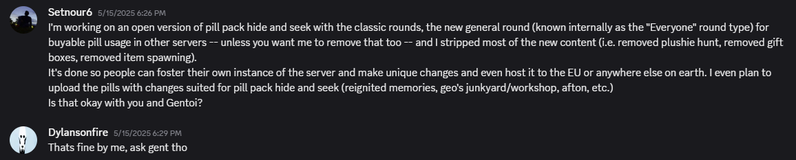
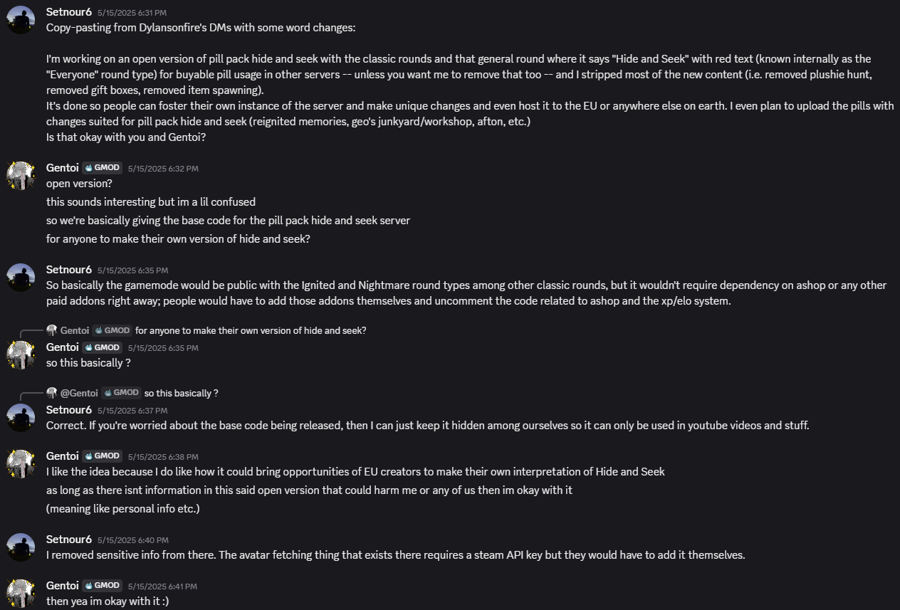

> [!WARNING]
> ***This is an early public release*** due to circumstances in Gentoi's Pill Pack Hide and Seek server which led to the lead developer, Dylansonfire, leaving and moving on to other projects. **THERE WILL BE BUGS!**

# The Open Pill Pack Hide and Seek Initiative
Started by Setnour6 and proceeded with the approvals from Gentoi and Dylansonfire, the original makers of the well-known Pill Pack Hide and Seek gamemode.

The goal of the initiative is to provide the gamemode with all available content from the very first introduction of the server to everyone, for everyone to host their own instance of -- be it in North America, South America, the European Union, and so on.

## Required Content

Please see REQUIREMENTS.TXT

## Features

**Returning Features:**
- Randomized Rounds and Seeker Choices
- Start with Empty Hands
- Survival, Movement & Killing ELO

**New Features:**
- New Poppy Playtime Pills, Chapter 1 to 4
- More ambient themes for the classic rounds
- Seeker Pity system
- Buyable Pills (needs to be enabled manually with AShop installed)
- Nametag System to see who is who, but seekers cannot see hiders unless they are staff members[^1]
- Modified the text effect for the "Nightmare" round type
- Reworked text effect for the "Hour of Joy" round type (can be restored to the original text effect)
- Auto-Ghosts, with a 25% chance to happen if there are more than 10 hiders alive. This won't happen on the "Twisted Ones" or "Man Behind the Slaughter" round types
- Seeker limits for certain maps
- More ELO from kills as seeker
- Modified the way how ELO gain/loss works
- The ability to disable/enable ELO for yourself (commented out by default, you can uncomment it yourself but you must make a settings panel/area or console command. See [Enable Features](enable-features.md))
- Modified spawn locations on certain maps
- Glitchtrap now moves faster gradually alongside after infecting hiders
- Vanny moves faster after killing or letting go of hiders
- Alternative round starting music for the Anomaly round

**Removed Features:**
- Start with Flashlight SWEP. Now other people need to add that to replace weapon_empty_hands
- Some Poppy Playtime Pills are no longer available due to the takedown of the Poppy Playtime Pill Pack Ultimate addon

Any of the features can be modified to your liking on your own instance (refer to installation).

## Installation

ALL methods require the Open PPHNS Base Content Packs and Server-Side Packs through following the methods below.

***GitHub Repository***:
You are assumed to know how GitHub works.
1. Download the repository from the main/master branch as a ZIP file
2. Unzip the downloaded folder and put the `pillpackhideandseek` folder in `<Garry's Mod Installation>\garrysmod\gamemodes`.

***Workshop Extraction***:
1. Open your favourite workshop extraction tool (steamcmd, WorkshopDL, GMPublisher w/ GUI).
2. Follow the steps and fill the necessary fields to extract the gamemode from the workshop
3. From the output/destination folder, put the `pillpackhideandseek` folder in `<Garry's Mod Installation>\garrysmod\gamemodes`.

***Workshop Subscription***:
1. Search "Pill Pack Hide and Seek" under the gamemode filter.
2. Subscribe to the gamemode

NOTE: When doing the Workshop Subscription method, you will not be able to have as much flexibility on customizing the gamemode to add more rounds or make other changes to your liking.

### Notice

This is done mainly as a hobby project.

You are assumed to have some knowledge in gamemode development for Garry's Mod when modifying the gamemode itself or adding content for use in the gamemode (i.e. more pills, adding weapons, adding round types, and so on).
If you are using AShop and/or Elite XP System 2, you need to uncomment the relevant code in the gamemode in order to use the functions/methods there (search keywords are "ashop" and "elitexp").

# Licensing and Publicity

All rights reserved. Full credits go to Gentoi, Zoomrh, and Dylansonfire for their work on the original pill pack hide and seek gamemode.
You are not allowed (i.e. you are forbidden) to reupload this gamemode/repository to the steam workshop or anywhere else.

[^1]: A user group containing the word "mod" must exist in your server or instance's admin mod panel.
